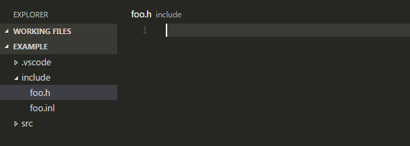
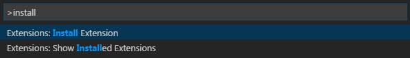

# Switcher for Visual Studio Code
[](https://marketplace.visualstudio.com/items?itemName=blackmery.vscode-switcher) [](https://marketplace.visualstudio.com/items?itemName=blackmery.vscode-switcher) [](https://github.com/blackmery/vscode-switcher/issues) [](LICENSE)

Switcher is an extension for the Visual Studio Code.  
This extension provides the ability to switch to a file of a different file extension with the same file name.



## Installation

Press `F1` in VS Code, type `install` and then look for `Switcher`.



## Key bindings

| Keys       | Commands                        |
|------------|---------------------------------|
| Alt+O      | Switcher: Default               |
| Ctrl+Alt+O | Switcher: In the Workspace Root |

#### Change the key bindings

Press `F1` in VS Code, type `Keyboard Shortcuts` and then edit a `keybindings.json`.

```
{ "key": "alt+o",      "command": "extension.switcher.doSwitch" },
{ "key": "ctrl+alt+o", "command": "extension.switcher.doSwitchInWorkspaceRoot" }
```

## Configurations

#### Add or change the search order of the file extension

Add a suffix to search for the file name, and can also change the search order.   
Press `F1` in VS Code, type `User Settings` or `Workspace Settings` and then edit a `settings.json`.

```
"switcher.findSuffixOrder": [
    ".m",
    ".mm",
    ".cs",
    ".cpp",
    ".cxx",
    ".c++",
    ".cc",
    ".c",
    ".h",
    ".hpp",
    ".hxx",
    ".inc",
    ".inl",
    "-inl.h",
    "_inl.h",
    ".js",
    ".html",
    ".css"
]
```

#### Change the `Switcher: Default` of behavior

You can the behavior of the `Switcher: Default`. The default of the config is `false`, but if you change the `true` will be the same behavior as the `Switcher: In the Workspace Root`.  
Press `F1` in VS Code, type `User Settings` or `Workspace Settings` and then edit a `settings.json`.

```
"switcher.findAllFilesInRootDirectory": false
```

## Changes

Version 0.1.1: June 16, 2016

- Upload a icon of the Switcher.
- Update a README.md.

Version 0.1.0: June 15, 2016

- First release.


## More information

- [Switcher on the Visual Studio Marketplace](https://marketplace.visualstudio.com/items?itemName=blackmery.vscode-switcher)
- [GitHub repository](https://github.com/blackmery/vscode-switcher)
